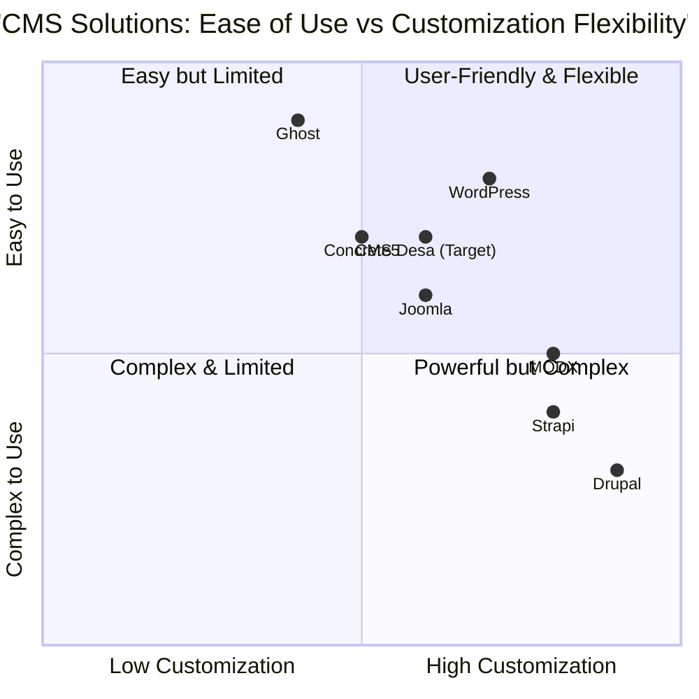

# Product Requirements Document (PRD)
# CMS Desa - Sistem Manajemen Konten Desa Berbasis Flask

## 1. Informasi Proyek

**Bahasa:** Bahasa Indonesia  
**Bahasa Pemrograman:** Flask (Python), Bootstrap 5, PostgreSQL  
**Nama Proyek:** cms_desa  
**Tanggal:** September 2025  

### Kebutuhan Asli
Membangun sistem manajemen konten (CMS) untuk website desa berbasis Flask dengan workflow publikasi bertingkat, manajemen role yang komprehensif, dan desain yang terinspirasi dari portal akademik Fakultas Teologi UKSW dengan branding desa.

## 2. Definisi Produk

### 2.1 Tujuan Produk

1. **Digitalisasi Administrasi Desa**: Menyediakan platform digital yang memungkinkan pemerintah desa mengelola dan mempublikasikan informasi secara terstruktur dan profesional
2. **Workflow Publikasi Terkontrol**: Mengimplementasikan sistem persetujuan bertingkat untuk memastikan kualitas dan akurasi informasi yang dipublikasikan
3. **Aksesibilitas Informasi Publik**: Memberikan akses mudah bagi masyarakat untuk mengakses informasi, berita, dan kegiatan desa secara real-time

### 2.2 User Stories

**US001 - Publisher Content Creation**  
Sebagai Publisher desa, saya ingin dapat membuat draft artikel berita dan kegiatan desa sehingga saya dapat menyiapkan konten untuk ditinjau sebelum dipublikasikan.

**US002 - Editor Content Review**  
Sebagai Editor, saya ingin dapat meninjau, mengedit, dan menyetujui atau menolak draft yang disubmit oleh Publisher sehingga kualitas konten yang dipublikasikan terjamin.

**US003 - Admin System Management**  
Sebagai Admin desa, saya ingin dapat mengelola seluruh user, role, dan konfigurasi sistem sehingga sistem CMS dapat beroperasi sesuai kebutuhan organisasi desa.

**US004 - Public Information Access**  
Sebagai warga desa, saya ingin dapat mengakses informasi terbaru tentang kegiatan dan pengumuman desa sehingga saya tetap terinformasi tentang perkembangan di desa.

**US005 - Multimedia Content Support**  
Sebagai content creator, saya ingin dapat menambahkan gambar cover dan video YouTube pada artikel sehingga konten menjadi lebih menarik dan informatif.

### 2.3 Analisis Kompetitif

**1. WordPress**
- *Pros*: Ecosystem plugin yang luas, user-friendly, community support besar
- *Cons*: Overhead yang besar, security vulnerabilities, membutuhkan maintenance rutin

**2. Drupal**
- *Pros*: Flexibility tinggi, robust permission system, enterprise-grade security
- *Cons*: Learning curve yang steep, kompleksitas konfigurasi, resource intensive

**3. Ghost**
- *Pros*: Focus pada publishing, modern interface, built-in SEO
- *Cons*: Terbatas untuk complex workflows, kurang customizable untuk government needs

**4. Strapi (Headless CMS)**
- *Pros*: API-first approach, modern tech stack, flexible content modeling
- *Cons*: Membutuhkan frontend development, kompleks untuk non-technical users

**5. Joomla**
- *Pros*: Balance antara flexibility dan usability, built-in multilingual support
- *Cons*: Declining community, security issues, outdated architecture

**6. MODX**
- *Pros*: Developer-friendly, flexible templating, good security track record
- *Cons*: Smaller community, learning curve, limited third-party extensions

**7. Concrete5**
- *Pros*: In-context editing, user-friendly interface, good for small organizations
- *Cons*: Performance issues, limited scalability, smaller ecosystem

### 2.4 Competitive Quadrant Chart



## 3. Spesifikasi Teknis

### 3.1 Analisis Kebutuhan

Sistem CMS Desa memerlukan arsitektur yang mendukung:

- **Multi-role Authentication & Authorization**: Sistem harus dapat membedakan akses berdasarkan role (Admin, Editor, Publisher, Public)
- **Content Workflow Management**: Implementasi state machine untuk status konten (draft → pending_review → published/rejected)
- **Media Management**: Dukungan upload gambar dan embed YouTube dengan validasi
- **Database Scalability**: Struktur database yang dapat menangani growth data desa
- **Security Compliance**: Implementasi security best practices untuk aplikasi government
- **Responsive Design**: Interface yang dapat diakses dari berbagai device
- **Production Ready**: Konfigurasi yang siap untuk deployment production

### 3.2 Requirements Pool

#### P0 (Must-Have) Requirements

**REQ001 - User Authentication & Role Management**
- Sistem MUST mengimplementasikan authentication dengan password hashing (bcrypt/argon2)
- Sistem MUST mendukung 4 role: Admin, Editor, Publisher, Public/Guest
- Admin MUST dapat melakukan CRUD operations pada user dan role

**REQ002 - Content Workflow System**
- Sistem MUST mengimplementasikan workflow: draft → pending_review → published/rejected
- Publisher MUST dapat membuat dan mengedit draft sendiri
- Editor MUST dapat review, edit, approve, atau reject content dengan komentar
- Public MUST hanya dapat melihat content dengan status published

**REQ003 - Database & Configuration Management**
- Sistem MUST menggunakan PostgreSQL sebagai database utama
- Sistem MUST menyimpan semua credential di file .env
- Sistem MUST memiliki config.py untuk environment mapping (Development/Production)
- Sistem MUST menyediakan seed data dengan role default dan 1 user Admin

**REQ004 - Security Implementation**
- Sistem MUST mengimplementasikan CSRF protection
- Sistem MUST mengimplementasikan role-based access control di setiap route
- Sistem MUST melakukan validasi dan sanitasi input untuk mencegah XSS
- Password MUST di-hash menggunakan bcrypt atau argon2

#### P1 (Should-Have) Requirements

**REQ005 - Media & Content Features**
- Sistem SHOULD mendukung upload cover image untuk artikel
- Sistem SHOULD mendukung embed YouTube dengan mini-player
- Sistem SHOULD melakukan validasi input (judul unik, slug unik, URL YouTube valid)
- Sistem SHOULD menyediakan dashboard berbeda sesuai role

**REQ006 - User Interface & Experience**
- UI SHOULD terinspirasi dari website Fakultas Teologi UKSW
- Design SHOULD formal, rapi, dengan tema hijau lembut
- Layout SHOULD mirip portal akademik dengan navigasi yang jelas
- Interface SHOULD responsif menggunakan Bootstrap 5 + custom CSS

#### P2 (Nice-to-Have) Requirements

**REQ007 - Advanced Features**
- Sistem MAY mengimplementasikan notification system untuk workflow
- Sistem MAY menyediakan content scheduling untuk auto-publish
- Sistem MAY mengimplementasikan content versioning
- Sistem MAY menyediakan analytics dashboard untuk content performance

**REQ008 - Integration & API**
- Sistem MAY menyediakan REST API untuk mobile app integration
- Sistem MAY mengintegrasikan dengan social media untuk auto-sharing
- Sistem MAY mengimplementasikan SEO optimization tools

### 3.3 UI Design Draft

#### 3.3.1 Public Interface Layout
```
+--------------------------------------------------+
|  HEADER: Logo Desa | Navigation Menu | Login     |
+--------------------------------------------------+
|  HERO SECTION: Slider Berita Utama              |
+--------------------------------------------------+
|  CONTENT GRID:                                   |
|  [Berita 1] [Berita 2] [Berita 3]              |
|  [Kegiatan 1] [Kegiatan 2] [Pengumuman 1]      |
+--------------------------------------------------+
|  SIDEBAR: Info Desa | Kontak | Link Terkait     |
+--------------------------------------------------+
|  FOOTER: Copyright | Social Media | Sitemap      |
+--------------------------------------------------+
```

#### 3.3.2 Dashboard Layout (Internal Users)
```
+--------------------------------------------------+
|  HEADER: Logo | User Menu | Notifications        |
+--------------------------------------------------+
|  SIDEBAR:     |  MAIN CONTENT AREA              |
|  - Dashboard  |                                  |
|  - Content    |  [Role-specific content]        |
|  - Users*     |                                  |
|  - Settings*  |                                  |
|  - Logout     |                                  |
|               |                                  |
| *Admin only   |                                  |
+--------------------------------------------------+
```

#### 3.3.3 Content Editor Interface
```
+--------------------------------------------------+
|  CONTENT FORM:                                   |
|  Title: [________________]                       |
|  Slug:  [________________] (auto-generated)      |
|  Cover: [Upload Image] [Preview]                 |
|  YouTube: [URL Input] [Preview Player]           |
|  Content: [Rich Text Editor]                     |
|  Status: [Draft/Pending/Published] (read-only)   |
|  Actions: [Save Draft] [Submit Review] [Publish] |
+--------------------------------------------------+
```

### 3.4 Database Schema Design

#### 3.4.1 Core Tables
```sql
-- Users table
users (
    id SERIAL PRIMARY KEY,
    username VARCHAR(50) UNIQUE NOT NULL,
    email VARCHAR(100) UNIQUE NOT NULL,
    password_hash VARCHAR(255) NOT NULL,
    role_id INTEGER REFERENCES roles(id),
    is_active BOOLEAN DEFAULT TRUE,
    created_at TIMESTAMP DEFAULT NOW(),
    updated_at TIMESTAMP DEFAULT NOW()
);

-- Roles table
roles (
    id SERIAL PRIMARY KEY,
    name VARCHAR(50) UNIQUE NOT NULL,
    description TEXT,
    permissions JSONB
);

-- Content table
content (
    id SERIAL PRIMARY KEY,
    title VARCHAR(255) NOT NULL,
    slug VARCHAR(255) UNIQUE NOT NULL,
    content TEXT,
    excerpt TEXT,
    cover_image VARCHAR(255),
    youtube_url VARCHAR(255),
    status content_status DEFAULT 'draft',
    author_id INTEGER REFERENCES users(id),
    reviewer_id INTEGER REFERENCES users(id),
    review_comment TEXT,
    published_at TIMESTAMP,
    created_at TIMESTAMP DEFAULT NOW(),
    updated_at TIMESTAMP DEFAULT NOW()
);

-- Content status enum
CREATE TYPE content_status AS ENUM ('draft', 'pending_review', 'published', 'rejected');
```

### 3.5 Open Questions

1. **Content Categories**: Apakah diperlukan sistem kategorisasi konten (Berita, Kegiatan, Pengumuman, dll.)?
2. **File Storage**: Apakah menggunakan local storage atau cloud storage (AWS S3, Google Cloud Storage) untuk media files?
3. **Email Notifications**: Apakah diperlukan email notification untuk workflow approval?
4. **Content Archiving**: Bagaimana policy untuk archiving atau deletion content lama?
5. **Multi-language Support**: Apakah diperlukan dukungan multi-bahasa (Indonesia/Daerah)?
6. **Mobile App**: Apakah akan ada mobile app companion yang memerlukan API?
7. **Backup Strategy**: Bagaimana strategi backup database dan media files?
8. **Performance Requirements**: Berapa concurrent users yang harus didukung?

## 4. Technical Architecture

### 4.1 Application Structure
```
cms_desa/
├── app/
│   ├── __init__.py
│   ├── models/
│   │   ├── __init__.py
│   │   ├── user.py
│   │   ├── role.py
│   │   └── content.py
│   ├── blueprints/
│   │   ├── auth/
│   │   ├── admin/
│   │   ├── editor/
│   │   ├── publisher/
│   │   └── public/
│   ├── static/
│   │   ├── css/
│   │   ├── js/
│   │   └── images/
│   └── templates/
├── migrations/
├── config.py
├── requirements.txt
├── .env.example
├── run.py
└── README.md
```

### 4.2 Technology Stack
- **Backend**: Flask 2.3+, SQLAlchemy, Flask-Migrate
- **Database**: PostgreSQL 13+
- **Authentication**: Flask-Login, Werkzeug Security
- **Forms**: Flask-WTF, WTForms
- **Frontend**: Bootstrap 5, jQuery, Custom CSS
- **Security**: Flask-CSRF, input validation
- **Deployment**: Gunicorn, Nginx (production)

## 5. Implementation Roadmap

### Phase 1 (Weeks 1-2): Core Foundation
- Setup project structure dan environment
- Implementasi database models dan migrations
- Basic authentication dan role system
- Admin user management interface

### Phase 2 (Weeks 3-4): Content Management
- Content CRUD operations
- Workflow implementation (draft → review → publish)
- Media upload functionality
- YouTube embed feature

### Phase 3 (Weeks 5-6): User Interface
- Public website interface
- Dashboard untuk setiap role
- Responsive design implementation
- UI/UX refinement

### Phase 4 (Week 7): Security & Testing
- Security audit dan penetration testing
- Input validation dan sanitization
- CSRF protection implementation
- Performance optimization

### Phase 5 (Week 8): Deployment & Documentation
- Production deployment setup
- Documentation completion
- User training materials
- Go-live preparation

## 6. Success Metrics

### 6.1 Technical Metrics
- **Response Time**: < 2 seconds untuk page load
- **Uptime**: 99.5% availability
- **Security**: Zero critical security vulnerabilities
- **Database Performance**: Query execution < 100ms average

### 6.2 User Experience Metrics
- **Content Publishing**: Workflow completion rate > 90%
- **User Adoption**: 100% staff adoption dalam 1 bulan
- **Public Engagement**: 50% increase dalam website visits
- **Mobile Usage**: 60% mobile traffic support

### 6.3 Business Metrics
- **Information Transparency**: 100% pengumuman desa terpublikasi
- **Response Time**: Pengumuman urgent published dalam < 2 jam
- **Content Quality**: < 5% content rejection rate
- **User Satisfaction**: > 4.0/5.0 user satisfaction score

## 7. Risk Assessment & Mitigation

### 7.1 Technical Risks
- **Database Performance**: Mitigasi dengan proper indexing dan query optimization
- **Security Vulnerabilities**: Regular security audits dan updates
- **Scalability Issues**: Horizontal scaling strategy dengan load balancer
- **Data Loss**: Automated backup strategy dengan point-in-time recovery

### 7.2 Operational Risks
- **User Training**: Comprehensive training program dan documentation
- **Content Workflow Bottleneck**: Clear escalation procedures dan backup reviewers
- **System Downtime**: Maintenance windows dan disaster recovery plan
- **Data Migration**: Thorough testing dan rollback procedures

## 8. Compliance & Legal Requirements

### 8.1 Data Privacy
- Compliance dengan UU No. 27 Tahun 2022 tentang Pelindungan Data Pribadi
- User consent untuk data collection
- Right to data deletion dan portability

### 8.2 Government Standards
- Compliance dengan Peraturan Menteri Dalam Negeri tentang Sistem Informasi Desa
- Accessibility standards (WCAG 2.1 Level AA)
- Information transparency requirements

## 9. Maintenance & Support

### 9.1 Regular Maintenance
- **Daily**: Automated backup verification
- **Weekly**: Security updates dan patches
- **Monthly**: Performance monitoring dan optimization
- **Quarterly**: Full system audit dan testing

### 9.2 Support Structure
- **Level 1**: Basic user support dan troubleshooting
- **Level 2**: Technical issues dan configuration
- **Level 3**: Development team untuk major issues
- **Emergency**: 24/7 contact untuk critical system failures

---

**Document Version**: 1.0  
**Last Updated**: September 14, 2025  
**Document Owner**: Product Management Team  
**Stakeholders**: Pemerintah Desa, IT Team, End Users